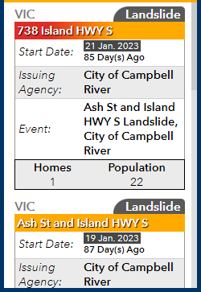

# Dashboard List Card
This expression displays feature attribute information in a fancy form in dashboard list widgets.

## Use cases
For displaying feature attributes in the dashboard list widget.

## Workflow
Copy and paste the expression found in the expression template below to the Arcade editor in a dashboard list widget in ArcGIS Online.

To configure the script to your layer, edit the first line to specify the field names you would like to use instead of the examples.

## Arcade Expression Template
```js
var NewestAlertDate = IIf(IsEmpty($datapoint["ALERT_DATE3"]),IIF(IsEmpty($datapoint["ALERT_DATE2"]),$datapoint["START_ALERT_DATE"],$datapoint["ALERT_DATE2"]), $datapoint["ALERT_DATE3"])
var NewestOrderDate = IIf(IsEmpty($datapoint["ORDER_DATE3"]),IIF(IsEmpty($datapoint["ORDER_DATE2"]),IIf(IsEmpty($datapoint["START_ORDER_DATE"]),"None",$datapoint["START_ORDER_DATE"]),$datapoint["ORDER_DATE2"]), $datapoint["ORDER_DATE3"])
var headercolour1 = IIF(NewestOrderDate  == "None","#FFAA00","#DE2D26")
var headercolour2 = "#FFAA00"
var AlertDate_Disp = Text(NewestAlertDate,"D MMM. Y")
var Duration = Round(DateDiff(Now(), NewestAlertDate, "days"))
var typecolour = IIF($datapoint["EVENT_TYPE"] == "Fire","#A80000",IIF($datapoint["EVENT_TYPE"] == "Flood","#004C73",IIF($datapoint["EVENT_TYPE"] == "Landslide","#595959","#000000")))

return {
  textColor: '',
  backgroundColor: '',
  separatorColor:'#ffffff',
  selectionColor: '#3390ff',
  selectionTextColor: '',
   attributes: {
     attribute1: AlertDate_Disp,
     attribute2: Duration,
     attribute3: headercolour1,
     attribute4: headercolour2,
     attribute5: typecolour
   }
}
```

## HTML Expression Template
```html
<div style="display:grid">
<div style="color:#7a7a7a; font-size:0.8vw; grid-column:1; text-shadow:1px 1px 1px #ffffff"><strong>{PREOC_CODE}</strong></div>

<div style="color:white; font-size:0.8vw; font-weight:bold; grid-column:2; text-align:right"><span style="background-color:{expression/attribute5}; border-radius:20px 5px 0 0; padding:0 5px 0 15px">{EVENT_TYPE}</span></div>
</div>

<div style="background-image:linear-gradient(to right,{expression/attribute3} 20%,{expression/attribute4},{expression/attribute4}); color:white; font-size:0.75vw; font-weight:bold; overflow:hidden; padding:2px 3px; text-overflow:ellipsis; text-shadow:1px 1px 1px rgba(0, 0, 0, 1); white-space:nowrap">{ORDER_ALERT_NAME}</div>

<div style="border-color:#969696; border-style:solid; border-width:0 1px">
<table cellspacing="0" style="border-collapse:collapse; border-spacing:2px; width:100%">
	<tbody>
		<tr style="border-bottom: 1px solid #D0CFD3;">
			<td style="font-size:0.75vw; padding-bottom:4px; padding-left:4px; width:40%"><em>Start Date:</em></td>
			<td style="font-size:0.6vw; padding-bottom:4px; width:60%"><span style="background-color:#474747; color:white; padding:0 2px">{expression/attribute1}</span><br />
			<span style="font-size:0.6vw"><strong>{expression/attribute2} Day(s) Ago</strong></span></td>
		</tr>
		<tr style="border-bottom: 1px solid #D0CFD3;">
			<td style="background-color:#ebebeb; font-size:0.75vw; padding-left:4px; width:40%"><em>Issuing Agency:</em></td>
			<td style="background-color:#ebebeb; font-size:0.75vw; padding-bottom:2px; width:60%"><strong>{ISSUING_AGENCY}</strong></td>
		</tr>
		<tr>
			<td style="font-size:0.75vw; padding-left:4px; width:40%"><em>Event:</em></td>
			<td style="font-size:0.75vw; padding-bottom:2px; width:60%"><strong>{EVENT_NAME}, {MUNICIPALITY}</strong></td>
		</tr>
	</tbody>
</table>
</div>

<div style="background-color:#ebebeb; display:grid">
<div style="border-color:black; border-style:solid; border-width:1px 0 0 1px; font-size:0.75vw; grid-column:1; grid-row:1; text-align:center"><strong>Homes</strong></div>

<div style="border-color:black; border-style:solid; border-width:0 0 1px 1px; font-size:0.75vw; grid-column:1; grid-row:2; text-align:center">{MULTI_SOURCED_HOMES}</div>

<div style="border-color:black; border-style:solid; border-width:1px 1px 0 0; font-size:0.75vw; grid-column:2; grid-row:1; text-align:center"><strong>Population</strong></div>

<div style="border-color:black; border-style:solid; border-width:0 1px 1px 0; font-size:0.75vw; grid-column:2; grid-row:2; text-align:center">{MULTI_SOURCED_POPULATION}</div>
</div>
```

## Example output
See [Example link](https://bcgov03.maps.arcgis.com/apps/dashboards/210a9177ed044703a855cb83d22eee5e) for examples of how to use this expression (Dashboard has limited access).


