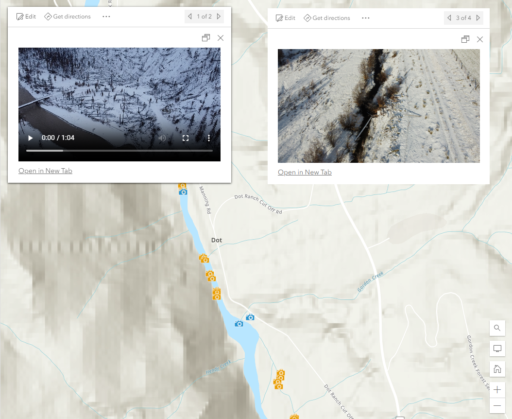

# Photo/Video Popups
This expression displays video or photo content in Map Viewer pop-ups from URLs via an attribute field.

## Use cases
If your hosted feature layers contains features that are associated with a mix of with both photo and video content and you want to display the photo or video in a pop-up.

## Workflow
Copy and paste the expression found in the expression template below to the Arcade editor in Map Viewer in ArcGIS Online.

To configure the script to your layer, edit the first line to specify the field name you would like to use instead of the example `MERGE_SRC` and `URL`.

```js
var MediaType = $feature["MERGE_SRC"]
var URL = $feature.URL
```

## Expression Template
```js
// get the media type (Video, Photo)
var MediaType = $feature["MERGE_SRC"]
var URL = $feature.URL

// if media is photo then set the HTML to display an img
if (MediaType == "Photo") {
    return {"type" : "text",
            "text" :`</img><a href="${URL}" rel="nofollow ugc">Open in New Tab</a>`}  
}
    
// if media is video then set the HTML to display a video
else if (MediaType == "Video") {
    return {"type" : "text",
            "text" :`<video controls="true" height="90%" width="100%"><source src="${URL}" type="video/mp4"></source></video><a href="${URL}" rel="nofollow ugc">Open in New Tab</a>`}
}
```

## Example output
See [Example link](https://bcgov03.maps.arcgis.com/home/item.html?id=7f4a9ac5cac847c6a3c84eace8f2f998) for examples of how to use this expression for both visualization and popups in ArcGIS Online (Web Map has limited access).

