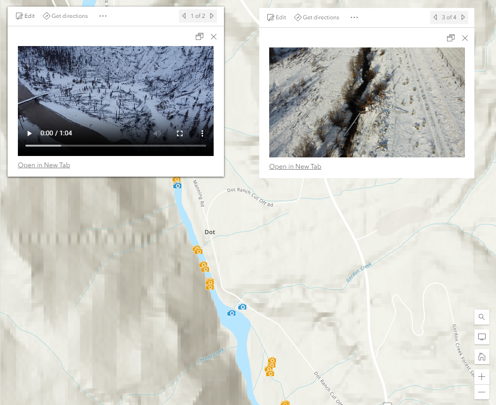

# Title
Brief description of what the code snippet does.

## Use cases
How can this snippet be used/what scenario.

## Workflow
Copy and paste the expression found in the expression template below to the Arcade editor in Map Viewer in ArcGIS Online.

To configure the script to your layer, edit the first line to specify the field name you would like to use instead of the example `FIELD NAME`.

```js
Can paste code of what variables/code to replace (as per text above) here.
```

## Expression Template
```js
Can paste entire code snippet into here.
```

## Example output
See [Example link](https://bcgov03.maps.arcgis.com/home/item.html?id=7f4a9ac5cac847c6a3c84eace8f2f998) for examples of how to use this expression.

<!--()-->
